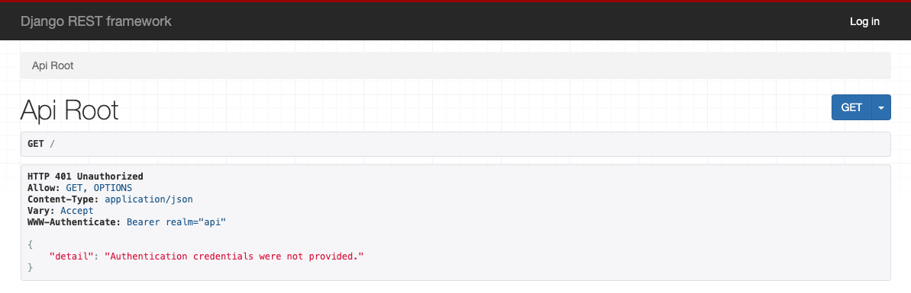

# Garage_Application


This is a Django REST Framework server program that can receive HTTP requests with a JSON formatted body payload.  To build and test the program please follow the steps below.

## Building

```sh
$ mkdir Garage_Application
$ cd Garage_Application
$ python3 -m venv env
$ git clone https://github.com/jakeMulhern/Garage_Application.git
$ source env/bin/activate
$ cd Garage_Application
$ pip install -r requirements.txt
```
Now, in the garage_application directory that contains settings.py create a new file called "config.py".
Inside of this file include
```sh
SECRET_KEY = <'the-secret-key-that-was-provided-to-you-earlier'>
```
-If you will be pushing any commits to GitHub create a .gitignore file and include config.py.


To confirm that the application was built correctly you may run the following
```sh
$ python manage.py runserver
```
Then visit `http://localhost:8000` to view the app.

Since this application is currently set up to utilize a JWT authentication
scheme you will see this:



## Running The Automated Tests
To run the automated tests run:

```sh
$ python manage.py test
```
You should notice in the terminal that 30 tests pass.

-The automated tests are located in "Garage_Application/garage_inventory/tests.py"
-The tests are designed to test each path in the server application.  They also include seperate tests for each path to ensure that every path is protected from anonymous usage thanks to the JWT authentication scheme.


## Testing the JWT Authentication Scheme:


-----------------------------------------------------------------------------------

Using HTTPie:

run the following commands in the terminal:
```sh
$ pip install httpie
$ python manage.py runserver
$ http post http://127.0.0.1:8000/api/token/
```
You should notice a "400 Bad Request" response and should see that password and username are required.

Now, with the server still running, run the following in the terminal:
```sh
$ http post http://127.0.0.1:8000/api/token/ username=admin password=password123
```
and now you should notice that the "access" and "refresh" tokens are now available to you.


-----------------------------------------------------------------------------------

Using curl:

To download curl:
```sh
$ pip install curl
$ python manage.py runserver
```
Then run the following in the terminal
```sh
curl \
  -X POST \
  -H "Content-Type: application/json" \
  http://localhost:8000/api/token/
```
You should get the following message:
```sh
{"username":["This field is required."],"password":["This field is required."]}
```
Next, with the server still running, run the following in the terminal:

```sh
curl \
  -X POST \
  -H "Content-Type: application/json" \
  -d '{"username": "admin", "password": "password123"}' \
  http://localhost:8000/api/token/
```
Now you should be able to see the "access" and "refresh" tokens successfully

-----------------------------------------------------------------------------------

## Exploring The API On A Locally Hosted Server

Now that you have seen that the API tests pass and that each route is protected from anonymous usage thanks to the JWT authentication scheme you may follow the steps below to explore and experiment with the API on a locally hosted server.

In "garage_application/settings.py" replace the "REST_FRAMEWORK" settings with the following:
```sh
REST_FRAMEWORK = {
    'TEST_REQUEST_DEFAULT_FORMAT': 'json',
    #'DEFAULT_AUTHENTICATION_CLASSES': (
    #    'rest_framework_simplejwt.authentication.JWTAuthentication',
    #),
    'DEFAULT_PERMISSION_CLASSES': (
        'rest_framework.permissions.IsAuthenticated',
    ),
}
```
Then in the terminal run:
```sh
$ python manage.py runserver
```
then navigate to `http://localhost:8000` and use the login at the top right corner using the credentials:
username: admin
password: password123

You may now freely explore.  You are able to step through different routes using the clickable URLs for convenience, add vehicles, delete them, and observe the details associated with each one.

